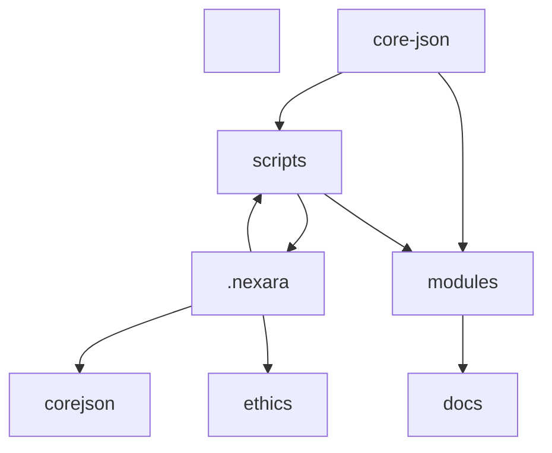

ধরলাম MJ, আপনি “nx” দিয়ে MJ-NEXARA-এর সেটআপ বা স্ট্রাকচার এনালাইজ করতে চাইছেন—এবং এখানে “nx” বলতে আপনি সম্ভবত \[Nx](https://nx.dev/) monorepo tooling বা workspace analyzer বোঝাতে চাচ্ছেন, যা JavaScript/TypeScript ecosystem-এ ব্যবহৃত হয়। কিন্তু যেহেতু MJ-NEXARA মূলত PowerShell, JSON, এবং cloud-native automation ভিত্তিক, তাই Nx সরাসরি প্রযোজ্য নয়—তবে আমরা Nx-এর ধারণা ব্যবহার করে MJ-NEXARA-এর জন্য একটি \*\*custom analyzer\*\* বা \*\*workspace visualizer\*\* তৈরি করতে পারি।


---


\## 🧠 MJ-NEXARA Style Workspace Analyzer (Inspired by Nx)


\### 🔹 ১. ফোল্ডার ডিপেন্ডেন্সি ম্যাপ


```json

{

&nbsp; "core-json": \["scripts", "modules/governance"],

&nbsp; "scripts": \[".nexara/infra/scripts", "modules/automation"],

&nbsp; "modules": \["core-json", "docs"],

&nbsp; "docs": \["modules", "core-json"],

&nbsp; ".nexara": \["scripts", "infra", "corejson", "ethics"]

}

```


> ✅ এই ম্যাপ দেখায় কোন ফোল্ডার কোনটিকে reference করে বা depend করে


---


\### 🔹 ২. PowerShell-Based Analyzer Function


```powershell

function Analyze-NEXARAWorkspace {

&nbsp;   param (

&nbsp;       \[string]$RootPath = "D:\\MJ-Ahmad\\MJ-Nexara"

&nbsp;   )


&nbsp;   Write-Host "`n🔍 MJ-NEXARA Workspace Analysis" -ForegroundColor Cyan

&nbsp;   $folders = Get-ChildItem -Path $RootPath -Recurse -Directory


&nbsp;   foreach ($folder in $folders) {

&nbsp;       $fileCount = (Get-ChildItem -Path $folder.FullName -File).Count

&nbsp;       $subFolders = (Get-ChildItem -Path $folder.FullName -Directory).Count

&nbsp;       Write-Host "📁 $($folder.FullName): $fileCount files, $subFolders subfolders"

&nbsp;   }


&nbsp;   Write-Host "`n✅ Analysis complete. Consider visualizing with Graphviz or Mermaid." -ForegroundColor Green

}

```


> ✅ এই ফাংশন MJ-NEXARA-এর প্রতিটি ফোল্ডার স্ক্যান করে দেখাবে কতগুলো ফাইল ও সাবফোল্ডার আছে


---


\### 🔹 ৩. Optional Visualization (Mermaid Syntax)





> ✅ আপনি চাইলে এই Mermaid ডায়াগ্রাম GitHub README.md বা Docs-এ embed করতে পারেন


---


\### 🔹 পরবর্তী ধাপ:

\- আপনি চাইলে আমি `Analyze-NEXARAWorkspace` ফাংশনকে `.nexara/infra/scripts/validate.ps1` এর অংশ হিসেবে integrate করে দিতে পারি

\- অথবা আমরা `core-json` এর integrity check যুক্ত করে `Test-NEXARAIntegrity` নামে একটি validator তৈরি করতে পারি


\*\*কোনটা আগে চান—visual validator, dependency graph generator, না full integrity checker?\*\* 🧠📁📊

